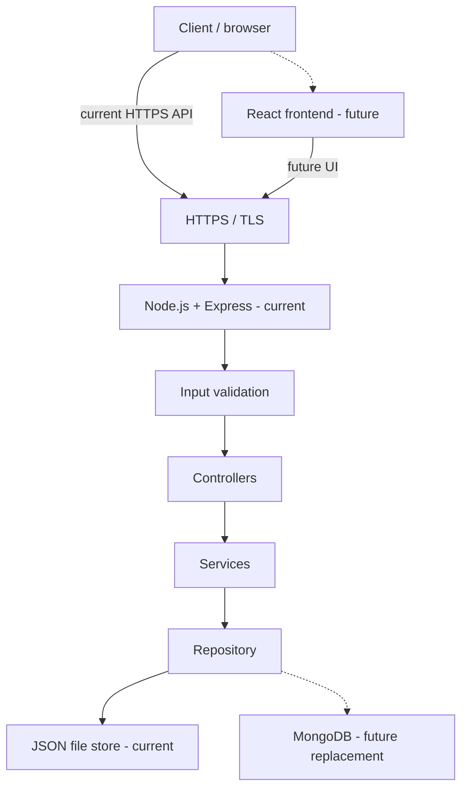
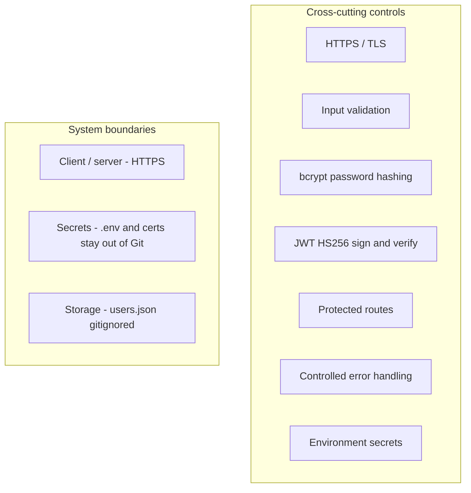

# HustleHub+

HustleHub+ is a secure freelance marketplace backend. This README is the project documentation. Do not add extra markdown files for setup or architecture notes.

## Local SSL certificate

HTTPS is HTTP over TLS/SSL (Node.js, 2026). A local certificate and private key are required so this API can use Node's HTTPS server with `key` and `cert` files (Node.js, 2026).

Certificates belong in `certs/` on your machine. Git is configured to ignore `certs/`, `*.pem`, `*.key`, and `*.crt` so private keys are not committed (Git, 2026; OWASP, 2021).

Set these paths in `.env` (see `.env.example`):

```
SSL_KEY_PATH=certs/localhost-key.pem
SSL_CERT_PATH=certs/localhost.pem
```

Create the folder:

```powershell
mkdir certs
```

### mkcert (Windows)

[mkcert](https://github.com/FiloSottile/mkcert) issues locally trusted development certificates (Valsorda, n.d.):

```powershell
mkcert -install
mkcert -key-file certs/localhost-key.pem -cert-file certs/localhost.pem localhost 127.0.0.1
```

`mkcert -install` installs a local CA so the browser trusts the cert (Valsorda, n.d.). The two files must match `SSL_KEY_PATH` and `SSL_CERT_PATH`.

### OpenSSL

If `openssl` is on your PATH (Git for Windows often includes it), you can make a self-signed certificate with `openssl req` (OpenSSL, 2026):

```powershell
openssl req -x509 -newkey rsa:2048 -sha256 -nodes -keyout certs/localhost-key.pem -out certs/localhost.pem -days 365 -subj "/CN=localhost"
```

Self-signed certificates are not in a public trust store. `curl` needs `-k` unless you trust the cert yourself (OpenSSL, 2026).

### Check

```powershell
Get-ChildItem certs
git status
```

You should see `localhost-key.pem` and `localhost.pem`. `git status` must not list them (Git, 2026).

## Starting the HTTPS server

`server.js` uses `https.createServer` with the key and cert from those paths (Node.js, 2026). Set `PORT`, `JWT_SECRET`, `SSL_KEY_PATH`, and `SSL_CERT_PATH` in `.env`, then:

```powershell
npm start
```

The log should show `https://localhost:3000` (or the port you set). If the `.pem` files or `JWT_SECRET` are missing, the process exits with a server-side message. It does not start an HTTP fallback (Node.js, 2026; OWASP, n.d.).

## HTTPS manual verification

Jest runs these tests in a Node environment, not a browser (Jest, 2026). SuperTest sends requests to the exported Express `app` and binds an ephemeral HTTP port if needed; it does not load `server.js` or call `https.createServer` (SuperTest, n.d.; Node.js, 2026). That is why `npm test` proves registration, login, JWT, and error bodies, but not TLS.

TLS has to be checked against the live HTTPS listener. HTTPS (HTTP over TLS) protects data in transit between client and server (OWASP, n.d.; Node.js, 2026).

### Automated tests (no TLS)

```powershell
npm test
```

Expected: all Jest suites pass. These requests never use `SSL_KEY_PATH` or `SSL_CERT_PATH`.

### Live HTTPS smoke test

1. Create `certs/localhost-key.pem` and `certs/localhost.pem` using the Local SSL certificate section above (Valsorda, n.d.; OpenSSL, 2026).
2. Put `PORT`, `JWT_SECRET`, `SSL_KEY_PATH`, and `SSL_CERT_PATH` in `.env`. Do not commit `.env` or the `.pem` files (OWASP, 2021; Git, 2026).
3. Start the server:

```powershell
npm start
```

4. Call the health check over HTTPS. Self-signed certificates are not in a public trust store, so `curl` needs `-k` (OpenSSL, 2026):

```powershell
curl.exe -k https://localhost:3000/
```

Expected: HTTP 200 and `{"status":"ok"}`. The URL scheme must be `https`, not `http`.

If port 3000 is already in use, set another `PORT` in `.env` (for example `3001`) and use that port in the `curl` URL.

5. Confirm a missing certificate does not fall back to HTTP: rename or remove the `.pem` files, run `npm start` again, and check that the process exits instead of listening on `http://`.

## Architecture

This is a Node.js and Express REST API (Express, 2026; Node.js, 2026). The finished HustleHub+ product is intended as a MERN system. This assessment stage implements the API and JSON storage only. React and MongoDB are future components and are not in the running process.

The request path is: client → HTTPS → Express → input validation → controllers → services → repository → JSON file. Error handling, bcrypt, and JWT are not extra steps in that path. They sit across the API as controls (Jones, Bradley and Sakimura, 2015; bcrypt, n.d.; OWASP, n.d.).

Solid arrows are current. Dashed arrows are future.



### Security controls and boundaries

These controls apply across the API. They are not a second data-flow pipeline (OWASP, n.d.; OWASP, 2021).



| Control | Where it sits |
|---|---|
| HTTPS / TLS | `server.js` — `https.createServer`; no HTTP fallback (Node.js, 2026; OWASP, n.d.) |
| Input validation | Before register/login logic |
| bcrypt hashing | User service — store `passwordHash` only (bcrypt, n.d.) |
| JWT sign / verify | Token service — `{ sub }` payload, HS256 (Jones, Bradley and Sakimura, 2015) |
| Protected routes | `authenticate` middleware on `GET /api/profile` |
| Controlled errors | Error handler — generic client JSON, log the real error server-side |
| Secrets boundary | `.env`, `certs/`, `data/users.json` are gitignored (Git, 2026; OWASP, 2021) |

The client/server trust boundary is TLS. The data boundary is the JSON file on disk (MongoDB later). Secrets do not cross into Git or into API error bodies.

## References

bcrypt (n.d.) *bcrypt*. Available at: https://www.npmjs.com/package/bcrypt (Accessed: 7 September 2026).

Express (2026) *Express 5.x API*. Available at: https://expressjs.com/en/5x/api.html (Accessed: 7 September 2026).

Git (2026) *gitignore*. Available at: https://git-scm.com/docs/gitignore (Accessed: 7 September 2026).

Jest (2026) *Configuring Jest*. Available at: https://jestjs.io/docs/configuration (Accessed: 7 September 2026).

Jones, M., Bradley, J. and Sakimura, N. (2015) *JSON Web Token (JWT)*. RFC 7519. Available at: https://www.rfc-editor.org/rfc/rfc7519.html (Accessed: 7 September 2026).

Node.js (2026) *HTTPS*. Available at: https://nodejs.org/docs/latest/api/https.html (Accessed: 7 September 2026).

OpenSSL (2026) *openssl-req*. Available at: https://docs.openssl.org/master/man1/openssl-req/ (Accessed: 7 September 2026).

OWASP (n.d.) *Transport layer security cheat sheet*. Available at: https://cheatsheetseries.owasp.org/cheatsheets/Transport_Layer_Security_Cheat_Sheet.html (Accessed: 7 September 2026).

OWASP (2021) *Secrets management cheat sheet*. Available at: https://cheatsheetseries.owasp.org/cheatsheets/Secrets_Management_Cheat_Sheet.html (Accessed: 7 September 2026).

SuperTest (n.d.) *supertest*. Available at: https://www.npmjs.com/package/supertest (Accessed: 7 September 2026).

Valsorda, F. (n.d.) *mkcert*. Available at: https://github.com/FiloSottile/mkcert (Accessed: 7 September 2026).
