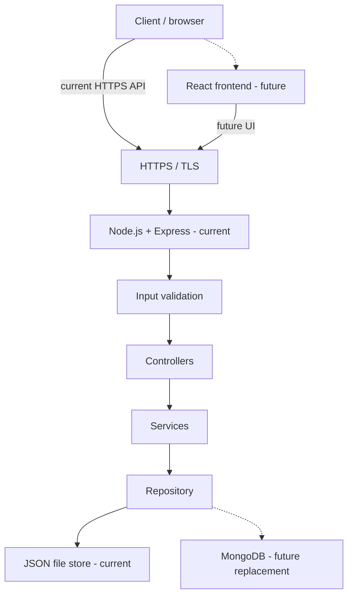
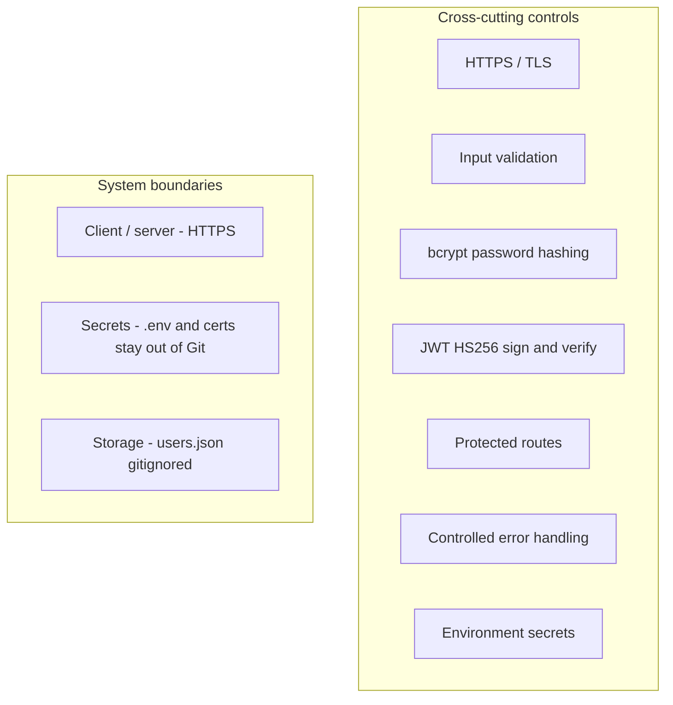

# HustleHub+

HustleHub+ is a secure freelance marketplace. This README is the project documentation. Do not add extra markdown files for setup or architecture notes.

## System overview

HustleHub+ will let freelancers advertise services and clients find and book that work. This assessment stage is the **API only**: users can register, log in, and read their own profile over HTTPS. Listings, bookings, and payments are not implemented.

The API runs on Node.js and Express (Express, 2026; Node.js, 2026). Passwords are stored as bcrypt hashes (bcrypt, n.d.). After login, the client sends a JWT on protected routes (Jones, Bradley and Sakimura, 2015). Traffic to `npm start` is HTTPS (Node.js, 2026; OWASP, n.d.).

## Intended users

- **Freelancers** — people who will later advertise services on the marketplace.
- **Clients** — people who will later browse and book those services.

This stage does not split those roles in the API. A registered account is one user record: `id`, `name`, `email`, and `passwordHash`.

## Current assessment scope

**Implemented now**

- `POST /api/auth/register`
- `POST /api/auth/login`
- `GET /api/profile` (Bearer JWT)
- JSON file storage in `data/users.json`
- HTTPS via local certificate files
- Jest + SuperTest for API behaviour (Jest, 2026; SuperTest, n.d.)

**Not in this stage (future)**

- React frontend
- MongoDB / Mongoose
- Service listings, browsing, bookings, payments
- Income and tax calculations
- Email verification, password reset, refresh tokens
- Multiple roles, OAuth
- Helmet, CORS, rate limiting
- Docker, cloud deployment

## Technology

| Piece | Role |
|---|---|
| Node.js | Runtime (Node.js, 2026) |
| Express | HTTP API (Express, 2026) |
| `data/users.json` | Current user store (not MongoDB) |
| bcrypt | Password hashing (bcrypt, n.d.) |
| jsonwebtoken | JWT sign and verify, HS256 (Jones, Bradley and Sakimura, 2015) |
| dotenv | Loads `.env` into `process.env` (dotenv, n.d.) |
| Jest + SuperTest | Automated tests against `app.js` (Jest, 2026; SuperTest, n.d.) |

The finished product is intended as **MERN** (MongoDB, Express, React, Node.js). This repository is the Express/Node layer plus JSON storage. React and MongoDB replace the dashed parts in the architecture diagram below.

## Backend structure

```
src/app.js                 Express app (no listen, no TLS)
src/server.js              HTTPS listener; requires JWT_SECRET and cert files
src/routes/                /api/auth and /api/profile
src/controllers/           HTTP in/out
src/services/              bcrypt, JWT, public user shape
src/repositories/          read/write data/users.json
src/middleware/            JWT auth, error handler
src/utils/                 validation, AppError, SSL path helpers
tests/                     Jest + SuperTest
data/                      users.json is created at runtime and gitignored
certs/                     local key and cert; gitignored
.env.example               placeholder variable names, not real secrets
```

Request path: route → controller → service → repository. Tests import `app.js`. TLS exists only in `server.js`.

## Architecture

This is a Node.js and Express REST API (Express, 2026; Node.js, 2026). The finished HustleHub+ product is intended as a MERN system. This assessment stage implements the API and JSON storage only. React and MongoDB are future components and are not in the running process.

The request path is: client → HTTPS → Express → input validation → controllers → services → repository → JSON file. Error handling, bcrypt, and JWT are not extra steps in that path. They sit across the API as controls (Jones, Bradley and Sakimura, 2015; bcrypt, n.d.; OWASP, n.d.).

Solid arrows are current. Dashed arrows are future.



### Security controls and boundaries

These controls apply across the API. They are not a second data-flow pipeline (OWASP, n.d.; OWASP, 2021).



The client/server trust boundary is TLS. The data boundary is the JSON file on disk (MongoDB later). Secrets do not cross into Git or into API error bodies.

## Security decisions

- **bcrypt** — plaintext is never stored, logged, or returned. Hashing uses cost factor **10**, the usual bcrypt default for this size of project (bcrypt, n.d.).
- **Password policy** — 8–128 characters, with uppercase, lowercase, a digit, and a special character. Names are capped at 100 characters. Login rejects passwords longer than 128 so huge strings never reach bcrypt.
- **JWT** — payload is `{ sub: userId }` only. Secret comes from `JWT_SECRET` with no hard-coded fallback. Expiry is `JWT_EXPIRES_IN` (default `1h`). Sign and verify are pinned to HS256 (Jones, Bradley and Sakimura, 2015).
- **Protected routes** — `GET /api/profile` requires `Authorization: Bearer <token>`. Missing, malformed, invalid, and expired tokens return 401. The handler loads the user from `sub` and returns `{ id, name, email }`.
- **Login failures** — unknown email and wrong password both return 401 `Invalid email or password.` so the client cannot tell which failed.
- **HTTPS** — `https.createServer` only. Missing cert files or `JWT_SECRET` stop the process; there is no HTTP fallback (Node.js, 2026; OWASP, n.d.).
- **Validation** — server-side, before hashing or token work. Invalid input is 400 with a short `error` string (Express, 2026).
- **Errors** — unexpected failures are logged on the server and returned as 500 `An internal server error occurred.` Malformed JSON bodies are 400 `Invalid JSON in request body.` Clients do not receive stacks, paths, or secrets.
- **Secrets** — `.env`, `certs/`, and `data/users.json` are gitignored. `.env.example` has empty/`replace` placeholders, not live secrets (Git, 2026; OWASP, 2021).
- **JSON storage** — a file store for this assessment so the API can persist users without MongoDB. It is not a production database. The file is not committed.

| Control | Where it sits |
|---|---|
| HTTPS / TLS | `server.js` — `https.createServer`; no HTTP fallback (Node.js, 2026; OWASP, n.d.) |
| Input validation | `src/utils/validation.js` before register/login logic |
| bcrypt hashing | User service — store `passwordHash` only (bcrypt, n.d.) |
| JWT sign / verify | Token service — `{ sub }` payload, HS256 (Jones, Bradley and Sakimura, 2015) |
| Protected routes | `authenticate` middleware on `GET /api/profile` |
| Controlled errors | Error handler — generic client JSON, log the real error server-side |
| Secrets boundary | `.env`, `certs/`, `data/users.json` are gitignored (Git, 2026; OWASP, 2021) |

## Installation

### Requirements

- Node.js (this project uses CommonJS)
- npm
- OpenSSL or [mkcert](https://github.com/FiloSottile/mkcert) to make a local certificate (OpenSSL, 2026; Valsorda, n.d.)

### Setup

```powershell
git clone https://github.com/akzz98/HustleHub.git
cd HustleHub
npm install
copy .env.example .env
```

Edit `.env`. Set a long random `JWT_SECRET`. Leave `JWT_SECRET=""` empty in `.env.example` only — the running app refuses a missing secret (OWASP, 2021).

```
PORT=3000
NODE_ENV=development
JWT_SECRET=put-a-long-random-value-here
JWT_EXPIRES_IN=1h
SSL_KEY_PATH=certs/localhost-key.pem
SSL_CERT_PATH=certs/localhost.pem
```

Do not commit `.env`.

### Local SSL certificate

HTTPS is HTTP over TLS/SSL (Node.js, 2026). A local certificate and private key are required so this API can use Node's HTTPS server with `key` and `cert` files (Node.js, 2026).

Certificates belong in `certs/` on your machine. Git is configured to ignore `certs/`, `*.pem`, `*.key`, and `*.crt` so private keys are not committed (Git, 2026; OWASP, 2021).

```powershell
mkdir certs
```

**mkcert (Windows)** — issues locally trusted development certificates (Valsorda, n.d.):

```powershell
mkcert -install
mkcert -key-file certs/localhost-key.pem -cert-file certs/localhost.pem localhost 127.0.0.1
```

`mkcert -install` installs a local CA so the browser trusts the cert (Valsorda, n.d.). The two files must match `SSL_KEY_PATH` and `SSL_CERT_PATH`.

**OpenSSL** — if `openssl` is on your PATH (Git for Windows often includes it), you can make a self-signed certificate with `openssl req` (OpenSSL, 2026):

```powershell
openssl req -x509 -newkey rsa:2048 -sha256 -nodes -keyout certs/localhost-key.pem -out certs/localhost.pem -days 365 -subj "/CN=localhost"
```

Self-signed certificates are not in a public trust store. `curl` needs `-k` unless you trust the cert yourself (OpenSSL, 2026).

```powershell
Get-ChildItem certs
git status
```

You should see `localhost-key.pem` and `localhost.pem`. `git status` must not list them (Git, 2026).

### Start

`server.js` uses `https.createServer` with the key and cert from those paths (Node.js, 2026).

```powershell
npm start
```

The log should show `https://localhost:3000` (or the port you set). If the `.pem` files or `JWT_SECRET` are missing, the process exits with a server-side message. It does not start an HTTP fallback (Node.js, 2026; OWASP, n.d.).

## API endpoints

Base URL: `https://localhost:3000` (use your `PORT`). Examples below use `curl.exe -k` because a self-signed cert is not publicly trusted (OpenSSL, 2026).

### `GET /`

Health check. No authentication.

```powershell
curl.exe -k https://localhost:3000/
```

**200** `{"status":"ok"}`

### `POST /api/auth/register`

Body: `name`, `email`, `password`. Password must be 8–128 characters with uppercase, lowercase, a digit, and a special character. Name at most 100 characters.

```powershell
curl.exe -k -X POST https://localhost:3000/api/auth/register -H "Content-Type: application/json" -d "{\"name\":\"John Smith\",\"email\":\"john@example.com\",\"password\":\"SecurePassword123!\"}"
```

| Status | When |
|---|---|
| 201 | Created. Body is `{ id, name, email }` only |
| 400 | Missing/invalid fields, bad email, weak password, name too long |
| 409 | Email already registered |

### `POST /api/auth/login`

Body: `email`, `password`.

```powershell
curl.exe -k -X POST https://localhost:3000/api/auth/login -H "Content-Type: application/json" -d "{\"email\":\"john@example.com\",\"password\":\"SecurePassword123!\"}"
```

| Status | When |
|---|---|
| 200 | `{ "token": "<jwt>" }` only |
| 400 | Missing/invalid body, password longer than 128 characters |
| 401 | Unknown email or wrong password — same message |

### `GET /api/profile`

Header: `Authorization: Bearer <token>`.

```powershell
curl.exe -k https://localhost:3000/api/profile -H "Authorization: Bearer PASTE_TOKEN_HERE"
```

| Status | When |
|---|---|
| 200 | `{ id, name, email }` |
| 401 | Missing, malformed, invalid, or expired token |
| 404 | Token valid but user no longer in the store |

Responses never include `password` or `passwordHash`.

A Postman collection is in `postman/HustleHub.postman_collection.json`. In Postman: Import → that file. Turn off **SSL certificate verification** (Settings) for the local self-signed cert (OpenSSL, 2026). Set `baseUrl` if your `PORT` is not 3000. Send **Register**, then **Login** (saves `token`), then **GET /api/profile**.

## Testing

Jest runs these tests in a Node environment, not a browser (Jest, 2026). SuperTest sends requests to the exported Express `app` and binds an ephemeral HTTP port if needed; it does not load `server.js` or call `https.createServer` (SuperTest, n.d.; Node.js, 2026). That is why `npm test` proves registration, login, JWT, and error bodies, but not TLS.

```powershell
npm test
```

Expected: all suites pass. Coverage includes valid/invalid registration, hashing, duplicate email, login success and generic 401, protected profile, malformed JSON, and generic 500 bodies with no stack or secret leak.

### HTTPS manual verification

TLS has to be checked against the live HTTPS listener. HTTPS (HTTP over TLS) protects data in transit between client and server (OWASP, n.d.; Node.js, 2026).

1. Create `certs/localhost-key.pem` and `certs/localhost.pem` (Valsorda, n.d.; OpenSSL, 2026).
2. Put `PORT`, `JWT_SECRET`, `SSL_KEY_PATH`, and `SSL_CERT_PATH` in `.env`. Do not commit `.env` or the `.pem` files (OWASP, 2021; Git, 2026).
3. `npm start`
4. `curl.exe -k https://localhost:3000/` — expected HTTP 200 and `{"status":"ok"}`. The URL scheme must be `https`, not `http`.

If port 3000 is already in use, set another `PORT` in `.env` (for example `3001`) and use that port in the `curl` URL.

5. Confirm a missing certificate does not fall back to HTTP: rename or remove the `.pem` files, run `npm start` again, and check that the process exits instead of listening on `http://`.

## Future development

Later POE stages may add React, MongoDB in place of `users.json`, marketplace listings, bookings, and payments. Those pieces are shown as dashed lines in the architecture diagram. They are not required to run this API.

## References

bcrypt (n.d.) *bcrypt*. Available at: https://www.npmjs.com/package/bcrypt (Accessed: 7 September 2026).

dotenv (n.d.) *dotenv*. Available at: https://www.npmjs.com/package/dotenv (Accessed: 7 September 2026).

Express (2026) *Express 5.x API*. Available at: https://expressjs.com/en/5x/api.html (Accessed: 7 September 2026).

Git (2026) *gitignore*. Available at: https://git-scm.com/docs/gitignore (Accessed: 7 September 2026).

Jest (2026) *Configuring Jest*. Available at: https://jestjs.io/docs/configuration (Accessed: 7 September 2026).

Jones, M., Bradley, J. and Sakimura, N. (2015) *JSON Web Token (JWT)*. RFC 7519. Available at: https://www.rfc-editor.org/rfc/rfc7519.html (Accessed: 7 September 2026).

Node.js (2026) *HTTPS*. Available at: https://nodejs.org/docs/latest/api/https.html (Accessed: 7 September 2026).

OpenSSL (2026) *openssl-req*. Available at: https://docs.openssl.org/master/man1/openssl-req/ (Accessed: 7 September 2026).

OWASP (n.d.) *Transport layer security cheat sheet*. Available at: https://cheatsheetseries.owasp.org/cheatsheets/Transport_Layer_Security_Cheat_Sheet.html (Accessed: 7 September 2026).

OWASP (2021) *Secrets management cheat sheet*. Available at: https://cheatsheetseries.owasp.org/cheatsheets/Secrets_Management_Cheat_Sheet.html (Accessed: 7 September 2026).

SuperTest (n.d.) *supertest*. Available at: https://www.npmjs.com/package/supertest (Accessed: 7 September 2026).

Valsorda, F. (n.d.) *mkcert*. Available at: https://github.com/FiloSottile/mkcert (Accessed: 7 September 2026).
